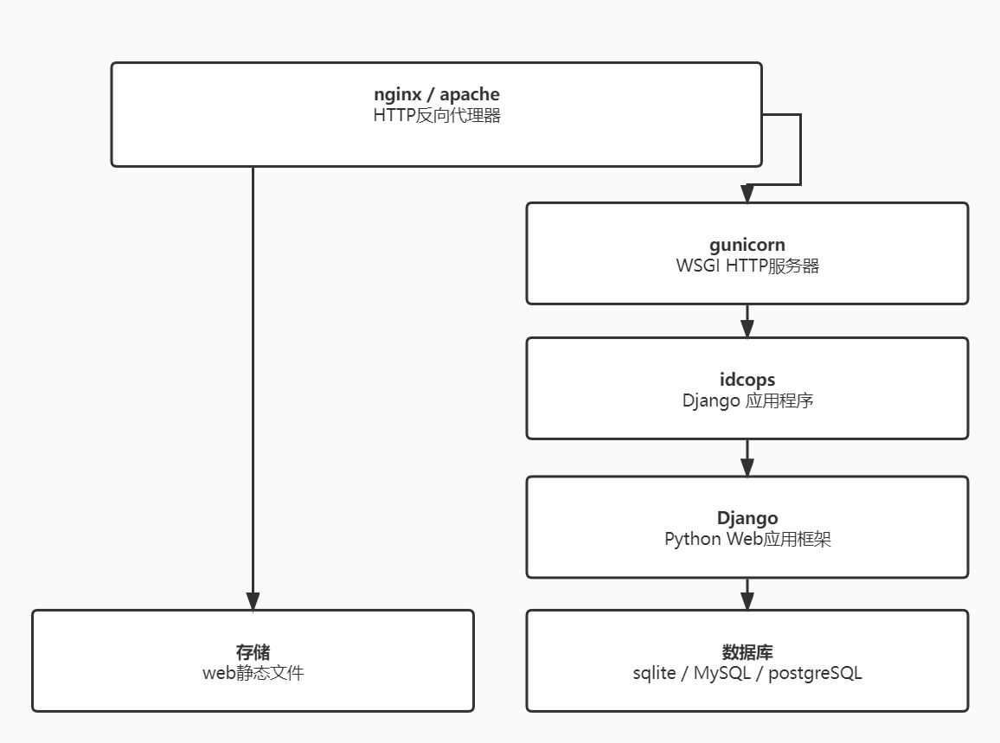

# 安装

此处提供的安装说明已经过测试，可在 Ubuntu 20.04 和 CentOS 8.2 上运行。在其他发行版上安装依赖项所需的特定命令可能会有很大差异。不幸的是，这超出了 idcops 维护人员的控制范围。请查阅您的发行版文档以获取有关任何错误的帮助。

以下部分详细介绍了如何设置 idcops 的新实例：

1. [MySQL数据库](1-mysql.md)
2. [idcops组件](2-idcops.md)
3. [Gunicorn](3-gunicorn.md)
4. [HTTP服务器](4-http-server.md)

## 要求

|依赖 |最低版本 |
|------------|-----------------|
| Python| 3.6 |
| MySQL | 5.5 |

以下是供参考的 idcops 应用程序堆栈的简化概述：

## 升级

如果您是从现有安装升级，请查阅 [升级指南](upgrading.md)。
